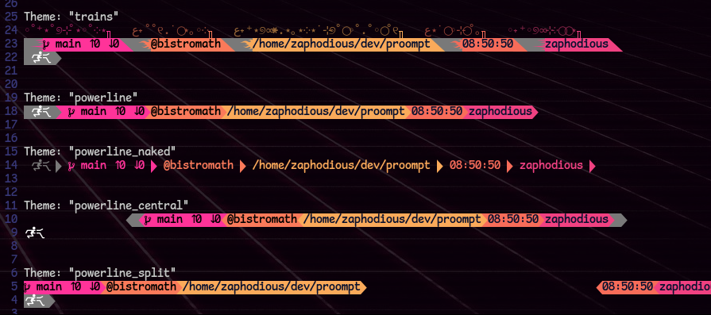

# Proompt Prompt Program

Generates a Bash command-line prompt!

## Installation

With cargo, run `cargo install --git https://github.com/Zaphodious/proompt.git`,
and reload your terminal.

Then, copy the contents of [the example.sh file](example.sh) into your .bashrc (or equivalent file),
making sure to replace your existing PS2 binding.

## Fonts

Please ensure that a [Nerd Font](https://www.nerdfonts.com/font-downloads)
is being used. To use the default carrot, a [font with extended unicode symbols](https://fonts.google.com/noto/specimen/Noto+Sans+Symbols+2)
should also be installed on your system.

# Usage

The command accepts several arguments. The -i, -c, -g, -w, and -t flags are one-time,
while any number of -s (Section) and --git-s (Git Section) flags can be passed in and are what make up
the prompt's content.

Colors are accepted in six-digit hex format (eg. ff00aa, f76c59, 07102e),
relying on full-color support from the terminal. The spcific way that 
"primary" and "secondary" colors are used depends on the theme.

Please always pass the ID of the current 
user via -i, as the program uses this to determine if it is running in a root
shell. See [the Q and A](#question) for why.

## Git 

To use specially-formatted git display modules, it is necessary to first
pass in the output of `$(git status --porcelain=v2 --branch 2>&1)` via -g. Then, any number of
--git-s blocks can be passed in, that will be displayed depending on
which of the repository states are detected: 

- all (displays regardless of status if the working dir is in a git repo)
- committed (displays when there are no changes detected)
- staged (displays when all changes are staged)
- unstaged (displays when there are unstaged changes)

Note that this allows for placing multiple
git blocks, and for placing git blocks at arbitrary places in the prompt.

For text passed into the sections, the following substitutions will be made:

- @b will be replaced with the branch name
- @u will be replaced with the upstream name
- @+ will be replaced with the no. of commits ahead of upstream
- @- will be replaced with the no. of commits behind upstream
- @s will be replaced with the detected repo status
- @i will be replaced with a unicode symbol representing the detected repo status
- @e will be replaced with an emoji representing the detected repo status

If no text is provided, the string " @b ↑@+ ↓@-" will be used as default. (the 
Nerd Font symbol for a git branch is used, which may not render in the browser.)

Note that this feature might not work in a broken or non-standard repo.

## Arguments

| Argument | Flag | Parameters | Default | Note |
| --- | --- | --- | --- | --- |
| User ID | -i | number | 1 | Used to detect if root. Please always pass. |
| Theme | -t | theme-name color (optional) root-color (optional) | trains | See ['Themes'](#themes) for theme options. Colors used depending on theme |
| Prompt Carrot | -c | string primary-color (optional) secondary-color (optional) | "🮲🮳" ffffff None/transparent| Used depending on theme (colors may also be overridden). Default carrot requires [font support](https://fonts.google.com/noto/specimen/Noto+Sans+Symbols+2) |
| Terminal Width | -w | cols | 80 | Used by some themes to compute positioning |
| Separators | --separators | left right | "" "" | Usage dependant on theme |
| Section | -s | primary-color secondary-color string | None | Displays the string as a section using the indicated colors |
| Break | --break | None | None | Tells the theme where a break is to occur. Not all themes utalize breaks |
| Solo Mode | --solo | None | None | Renders without the extra control strings used by the bash prompt system |
| Git Info | -g | output of `$(git status --porcelain=v2 --branch 2>&1)` | None | Used to compute other git display modules |
| Git Section | --git-s | status primary-color secondary-color text (optional) | The template string " @b ↑@+ ↓@-" | Displayed if the status is either "all", or matches the repo status (see [the git section](#git)) |

## Themes

- trains 
    - Uses -c
    - Section primary-color is background, secondary-color is text color
- powerline
    - Uses --separators and -c
    - Section primary-color is background, secondary-color is text color
- powerline_naked
    - Uses --separators and -c
    - Section primary-color is text color, secondary-color is not used
- powerline_central
    - Uses --separators, -c, and -w
    - Section primary-color is background, secondary-color is text color
- powerline_split
    - Uses --separators, -c, -w, and --break
    - Section primary-color is background, secondary-color is text color
- showcase 
     - Displays each of the themes using the provided input

### Showcase

Displayed: the output of [showcase.sh](showcase.sh), which uses the
"showcase" theme to display how each theme displays the provided input. Note 
the tight spacing- the themes display section text exactly as passed in.

Shown using the [Comic Mono Nerd Font](https://github.com/xtevenx/ComicMonoNF)

# Question?

Q: Why is everthing passed in, instead of queried by the program or put into a config file?

A: A few reasons. I wrote this program primarily for myself, and I wanted an 
easier time customizing my prompt theme then what I was getting with .oh-my-bash
and the like. I also didn't want to have to manually add support for everything 
I wanted to display in my prompt.

Q: But, why do you pass in the user ID and git info?

A: I use this program in multiple environments and don't want to
worry about weird cross-platform compat bugs that arise from system calls 
going weird. Even with git bash on Windows, passing things in is almost always
going to work. 

## Future

- More themes 
- ???
- Profit...?

# License

This program is licensed under the GPL v3 or any later versions.

